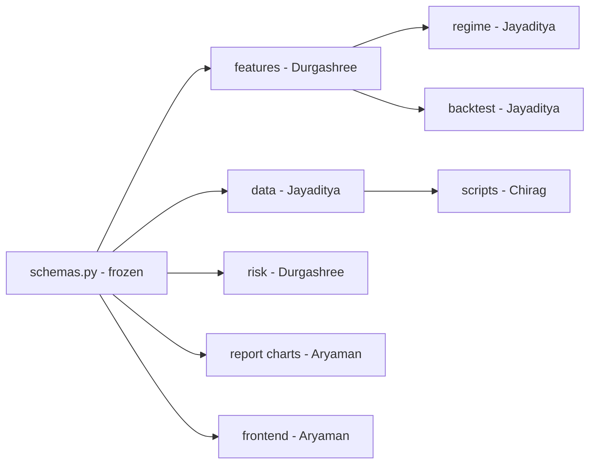

# Team Work Guides

Start with **your own file**, then skim the others so you understand your
boundaries. The full architecture lives in `../IMPLEMENTATION_PLAN.md` — these
files are *your* actionable slice of it.

| File | Owner | Owns |
|---|---|---|
| [JAYADITYA.md](JAYADITYA.md) | Jayaditya Dev | Backend core: `data` adapters, `regime`, `backtest`, `validation`, architecture, contracts |
| [DURGASHREE.md](DURGASHREE.md) | Durgashree M | `features`, `risk`, project report/methodology |
| [ARYAMAN.md](ARYAMAN.md) | Aryaman Tiwari | `report` charts + frontend (Streamlit → Next.js) |
| [CHIRAG.md](CHIRAG.md) | Chirag T | data pipeline scripts (`scripts/`), symbols seed, ops, slides |

## How to start (everyone)

```bash
git clone <repo-url>
cd indian-portfolio-intelligence
git checkout -b feat/<module>/<your-first-task>
cp .env.example .env
uv sync --extra dev          # Python 3.11 + all deps + dev tools
make test                    # confirm the baseline is green
```

## The parallel-workflow contract

The whole point of this scaffold is that **you should almost never be blocked on
another teammate**. Three rules make that true:

1. **Data shapes are frozen in `app/schemas.py`.** Every module consumes/produces
   those exact shapes. You can build your module against them *today* — you don't
   need the other person's module to exist.
2. **Fake it first.** Use `tests/fixtures/` (tiny synthetic parquet/csv) for
   development. You do NOT need live market data or another teammate's module to
   write and test yours.
3. **Interfaces over implementations.** Where one person's module calls another's,
   the *signature* is already written as a stub in the scaffold (e.g.
   `app/data/sources.py`, `app/data/cache.py`). Code against the signature; the
   implementation lands in parallel.

## Who depends on whom (keep it small)



- **No-blockers:** Durgashree (features/risk), Aryaman (charts/frontend) need only
  `schemas.py` + fixtures. Zero dependency on others.
- **One small upstream:** Chirag's `scripts/` call Jayaditya's `app/data`
  signatures (already stubbed). Jayaditya delivers `app/data` first in the spike.
- **Regime/backtest/recommend** (Jayaditya) need `features` columns → Durgashree
  must keep the `FEATURE_COLUMNS` names in `app/schemas.py` *exactly*. That is the
  single most important cross-person dependency. Reconfirm those column names once
  at kickoff, then never silently rename.

## Daily rules (non-negotiable)

1. `git pull origin main` into your branch **every evening**; resolve conflicts
   immediately (they'll mostly be in `schemas.py` or `pyproject.toml`).
2. Never commit to `main`. Feature branch + PR, one logical change per commit.
3. Conventional Commits (`feat:`, `fix:`, `test:`, `docs:`, `refactor:`, `chore:`).
4. If you change a schema/shared signature, tag the PR title `[contracts]` and
   update `app/schemas.py` + your doc + `../IMPLEMENTATION_PLAN.md` §10 in the
   same PR.
5. CI must be green: `make lint`, `make typecheck`, `make test` (mirrors CI).

## Definition of done (every task)

- CI green locally: `uv run ruff check app tests scripts && uv run mypy app && uv run pytest tests/unit`.
- Uses `app/schemas.py` shapes — no ad-hoc dicts at module boundaries.
- Unit tests present (integration tests marked `@pytest.mark.slow` if they touch I/O).
- No data leakage in any ML/backtest code (train/test time-ordered).
- Docs updated if you changed a contract.
